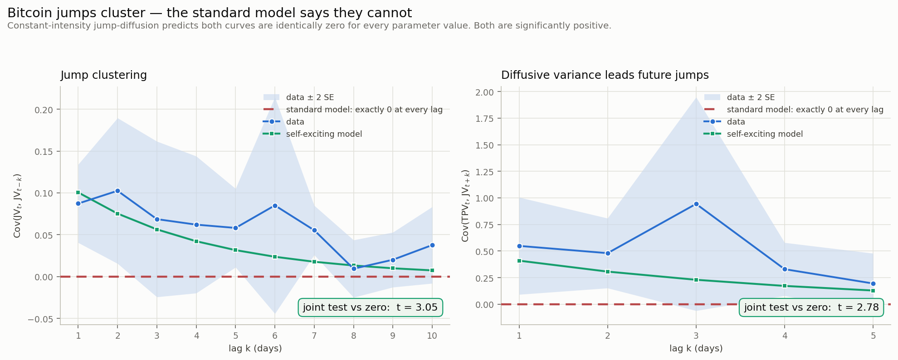
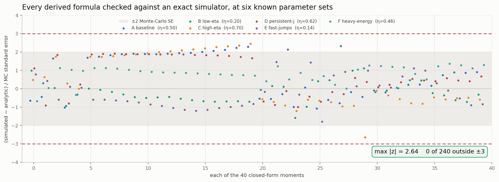
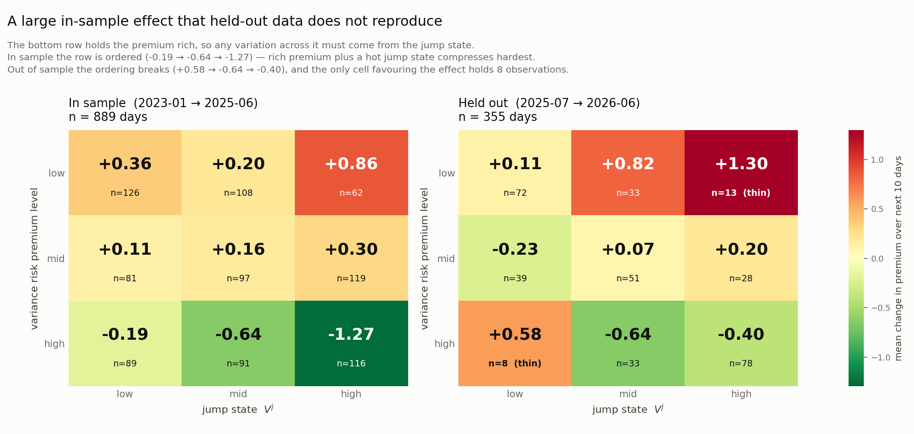

# Bitcoin jump clustering and the variance risk premium

I started this with a question I couldn't answer from reading alone: Bitcoin's price jumps
clearly arrive in bunches rather than evenly, so if a bunch is happening right now, does
that tell you anything about whether options are about to get cheaper?

Answering it needs a quantity you can't observe directly (how "agitated" the jump process
currently is), so most of this repo is the machinery to estimate that, plus the checks I
ran to convince myself the machinery actually worked before I trusted anything it said.

Data is 1.84 million one-minute bars from January 2023 to June 2026, plus Deribit's DVOL
index for the options side.

---

## What I found

### 1. Jumps cluster, and the standard model structurally can't allow it

The usual jump-diffusion setup assumes jumps arrive at a constant rate. That assumption
has a consequence you can test directly: jump energy on separate days should be
independent, so the autocovariance of daily jump variance is zero at every lag, for any
parameter values at all. There's no way to tune it away.

It isn't zero.

| Test | Standard model says | Data |
|---|---|---|
| Jump clustering, joint over 10 lags | 0 | t = 3.05 |
| Diffusive variance leading future jumps, 5 lags | 0 | t = 2.78 |
| Lag-1 jump clustering | 0 | t = 3.74 |



### 2. A self-exciting version fits

The fix is to let the jump arrival rate depend on the jump-variance state itself, so each
jump makes the next one more likely. This is a Hawkes process, and because the intensity
is affine in the state, all the moments stay in closed form, which is what makes the whole
thing estimable.

Fitting it by GMM on 40 moments, only 2 of the 40 miss by more than two standard errors,
which is about what you'd expect from noise alone, and the misses are scattered rather
than piled up in one block. The estimates say roughly 24% of jumps are aftershocks of
earlier jumps. Individual shocks fade with a 1.8 day half-life but clusters take 2.4 days,
which is the whole point of the extension: the cascade outlives the shock that started it.

### 3. There's a large variance risk premium

Implied variance sits about 20% above what the model expects physically, on 65% of days,
and about 25% above what actually gets realised. It mean-reverts with a half-life around
two weeks.

### 4. The model still doesn't decay slowly enough

On held-out crash events, variance stays elevated for about 9.5 days. My model predicts
2.4. A separate over-identification check points the same way (a factor of 6.3 gap), so
I'm fairly confident something slow is missing, probably a third variance factor. The
Hawkes extension moves in the right direction but not far enough.

## Checking the machinery before using it

This is the part I spent the most time on. The moments are 40 formulas I derived by hand,
and if any of them is wrong, everything downstream is quietly garbage.

So before running anything on real data I wrote an exact simulator (Ogata thinning for the
self-exciting jumps, noncentral chi-squared for the CIR factor, analytic integrals within
each day, so no discretisation error anywhere), generated 50,000+ days from six known
parameter sets, and checked every formula against what the simulation actually produced.



Every moment landed inside Monte Carlo error, max |z| of 2.64 with none of the 240 outside
±3. GMM recovered the true parameters, and the bootstrap intervals covered at 0.86 to 0.98
against a nominal 0.95.

This process caught four genuine bugs:

- **Tripower variation used the wrong exponent** (4/3, which estimates quarticity, instead
  of 2/3 for variance). My "jump variance" series was basically total variance. Caught by
  cross-checking against MedRV, a second jump-robust estimator, which now agrees at 0.996.
- **The block bootstrap was corrupting autocovariances.** It resliced the raw series and
  recomputed lag products, which splices unrelated days together at every block join.
  Coverage for one parameter was 0.00. Resampling the moment contributions instead fixed
  it to 0.93.
- **The GMM weighting matrix was scale-blind.** Shrinking toward a scaled identity ignores
  that moment variances span five orders of magnitude here, so the jump-clustering moments
  got almost no weight. This had inverted the persistence estimate (3.43 vs the correct
  0.29) and I only noticed by staring at fit residuals.
- **One of my two over-identification "tests" was an algebraic tautology.** It holds for
  any parameter values, so it tested nothing, and I'd written it up as a pass. The tell was
  that it came out exactly zero with zero variance in every bootstrap draw. Real quantities
  wobble.

## The actual question, and the honest answer

Sorting days by how rich the premium is and how hot the jump state is gives a clear
in-sample pattern. Holding the premium rich, a hot jump state compresses it roughly 20x
harder over the next ten days than a quiet one, and raises the odds of a large compression
by about 2.1x.



It does not hold up out of sample. On the held-out year the ordering breaks, and the only
cell that would support the effect has 8 observations in it. With something like 35
independent ten-day windows the holdout can't really confirm or refute anything, but it
certainly didn't confirm.

Three other results looked promising and didn't survive being tested properly:

- The premium seemed to predict variance-selling returns at t = 5.7, but the signal and the
  payoff both contain the implied variance leg (correlation 0.97). Control for it and the
  effect is gone (t = 0.99).
- The continuous-variance state seemed to predict premium changes at t = 2.5, but the
  model's forecast is built out of that state, so the relationship is mechanical (t = 8.5
  through that channel). Against pure market data it's t = 0.10.
- The structural forecast doesn't beat a three-term HAR regression (R² 0.117 vs 0.113).

I'd rather report all of this than quietly keep the version that looked best.

## How it works

Total variance comes from two latent factors: a persistent Brownian-driven CIR component
and a jump-driven component whose arrival intensity is affine in its own level. All 40
unconditional moments (means, variances, autocovariances, two-sided cross-covariances of
daily tripower variation and jump variance) stay in closed form, and I match them to sample
moments by GMM with an analytic 40x9 Jacobian, regularised weighting, and a moving-block
bootstrap for intervals.

Parameters are estimated on 2023-01 to 2025-06 only. Everything from 2025-07 onward,
including the October 2025 crash, is held out and never used in estimation.

## Running it

```bash
pip install -r requirements.txt
python run_all.py            # everything (the raw tick files aren't needed)
python run_all.py --quick    # skips the slow simulation study
python today.py              # current jump state and premium, with fresh DVOL
```

The raw tick data is 2.9 GB so it isn't in the repo, but the daily measures derived from it
are, so everything except the first two stages runs from a fresh clone. Seeds are fixed.

## Files

| | |
|---|---|
| `clean_prices.py`, `realized_measures.py` | ticks to 1-minute bars to daily RV / TPV / MedRV / JV |
| `damping.py`, `moments.py` | the 40 population moments and the analytic Jacobian |
| `gmm.py` | empirical moments, weighting, objective, block bootstrap |
| `selfcheck.py` | checks the code matches the algebra |
| `simulate.py`, `verify_simulation.py` | the exact simulator and the verification study |
| `estimate_train.py`, `plot_fit.py`, `overid_tests.py` | estimation and diagnostics |
| `event_study.py` | out-of-sample event study |
| `vrp*.py`, `jump_state_compression.py` | the variance risk premium work |
| `today.py` | current state readout |

`docs/affine_intensity_theory.pdf` is where I worked out the theory and derived the moments.
`writeup.pdf` is the short version with the results.

## What I'd do next

The persistence gap (9.5 days observed vs 2.4 predicted) and the factor-of-6.3
over-identification gap both point at the same missing piece, so a third slower variance
factor is the obvious extension. The compression result needs more than one year of
held-out data before it means anything either way. At this point the sample size is the
constraint, not the method.
